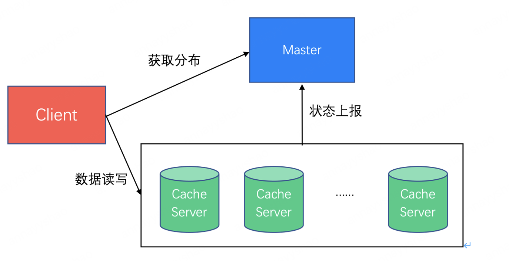
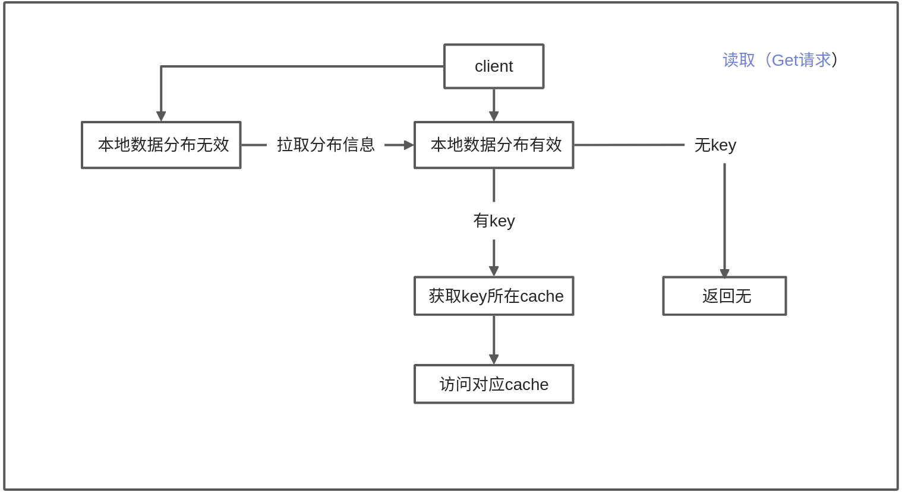
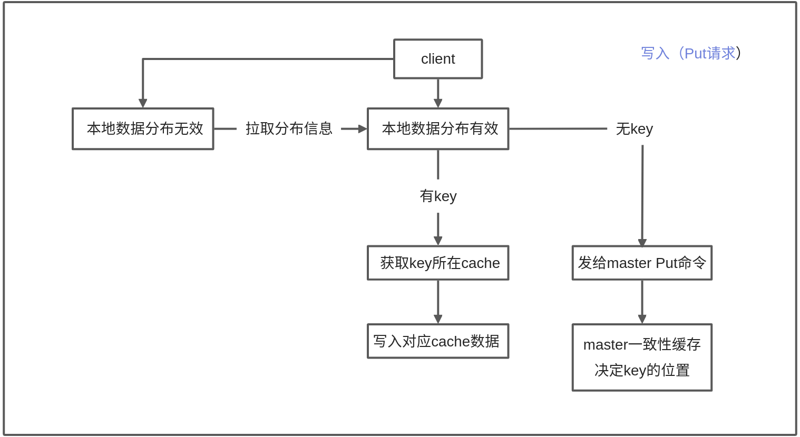

# Simple Distributed Cache (SDC)
## Requirements
- cmake
- linux
- mysql
## Usage
1. 开启master服务
```shell
./master
```
2. 开启cache服务,后面的数字代表cache编号,例如1,2,3...
```shell
./cache 1
```
3. 开启客户端，支持并发，可运行多个client
```shell
# 模式1,交互模式
./client
# 模式2,灌数据模式
./client fill
```
交互模式数据格式：`Put:123456,12345678911`或`Get:123456`.
## System structure

核心功能：
1. 单机LRU：单个Cache Server的LRU机制，只能保存至多指定数量的key，多余的按照LRU的机制淘汰
2. 分布式访问：Client会从Master拉取分布信息，并根据key来访问对应的Cache Server
3. 扩容/缩容和容灾：支持Cache Server的容灾，以及Cache Server的扩容和缩容操作
## Read and write
> 若client新请求距离上次client请求之间没有写请求，则本地数据分布缓存有效。这样能保证最大的命中率。



## Core function
- 每个server中的key、value采用LRU淘汰机制
- epoll多路复用实现客户端并发访问
- 日志功能：分块日志和总交互日志
- 长连接：过期服务端自动断连
- socket通信
- 手动查询k、v与大规模灌数据
- 连接后端mysql数据库，缓存失效后端可以查看失效记录
- 压力测试

## Expand and shrink (Cache)
- 扩容：cache可以另开，通过配置文件修改client的连接数量和新cache的ip与端口。扩容后客户端自适应连接新cache。
- 缩容：当有cache宕机后，master的一致性哈希会决策不再往宕机的chche写入。若访问宕机cache中存的元素，则会从后端mysql中寻找。